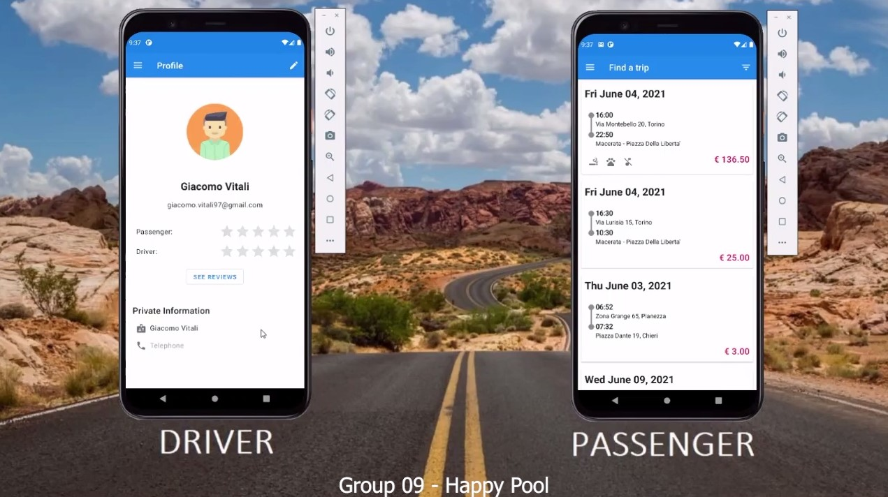
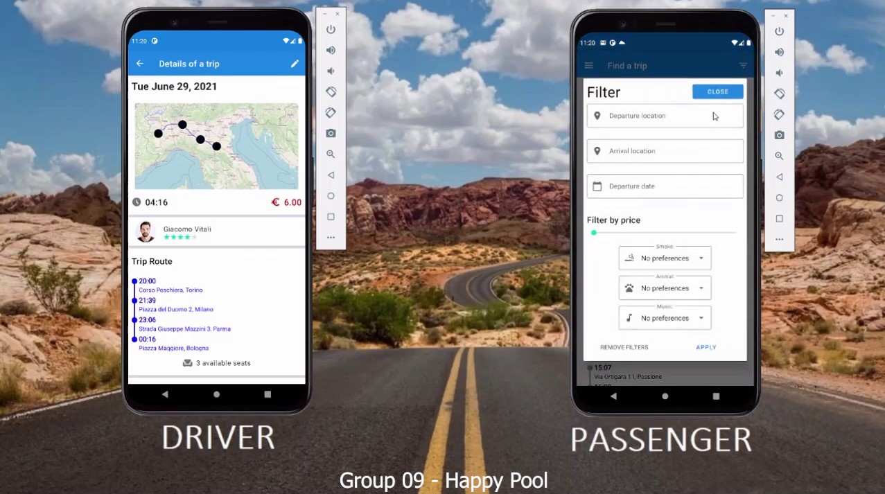
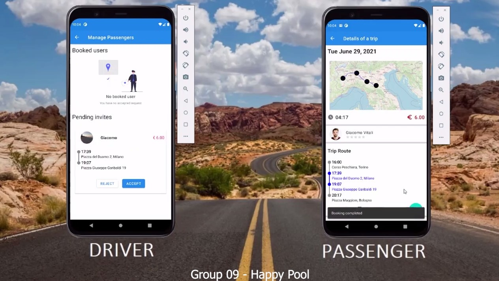
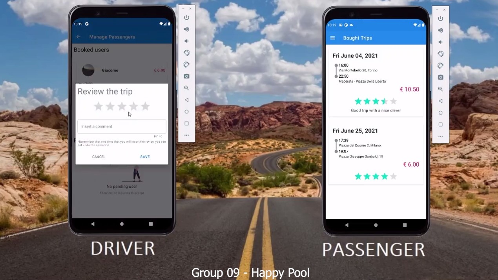

# CarPooling
Project of the Mobile Application Development course. From February 2021 - July 2021

Technologies: Android, Kotlin, Coroutine, Firebase, Firestore, LiveData.

## Overall Course Assignment
Create an app that supports car pooling.

The app should be used by two kinds of users.

- Drivers can advertise their destinations and dates, without disclosing their identities 
- Passengers can search for a specific travel and get in touch with drivers, agreeing on a price and on a meeting date and place

Whenever an deal is made, the app notifies the agreed upon details and provides a secure communication channel between the two partners. For each user subscribed to the system, the app maintains a ranking based on the number of deals and on a short questionnaire about the travel experience
Groups are encouraged to propose extensions to these basic requirements

Speech: https://github.com/GiaVit97/CarPooling/blob/main/docs/presentation.mp4

Some frame

